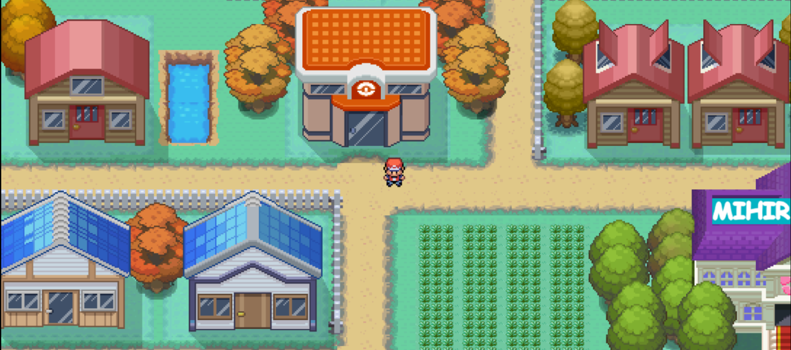

# DreamMist
DreamMist is a pokemon game made by using HTML canvas.

## Disclaimer

- Use "w" "a" "s" and "d" key for moving, make sure your caps lock is off. 

- Click on your screen once if the bg audio is not audible.

- please support the project by give the project star.

- The project got many bugs that i will prolly fix in future.

## What is HTML Canvas?
- An HTML canvas is a powerful and flexible HTML element that allows you to dynamically render graphics, animations, and other visual content directly on a web page using JavaScript.

## Map creation
- For creating map i used "Tiled" map editor.
Tiled is a popular open-source map editor for creating 2D tile-based maps. It is primarily used by game developers, but it can also be used for other applications that require the creation of maps and tilesets. 

## Animation
- Animation of transition is done by GSAP which is a javascript library used for creating high-performance animations and interactive content on websites. 

## Music
- For intregating music into the map i used Howler.js which is a JavaScript library that makes it easier to work with audio on the web.
